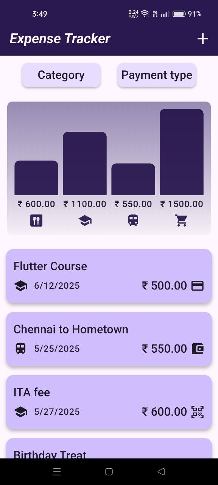
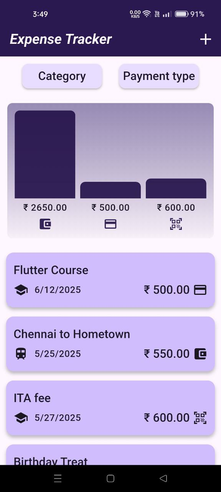
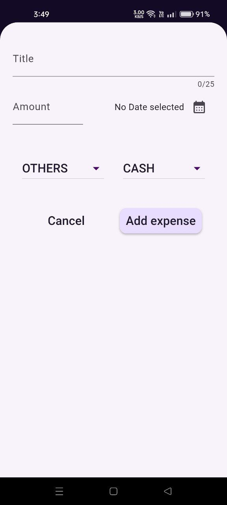
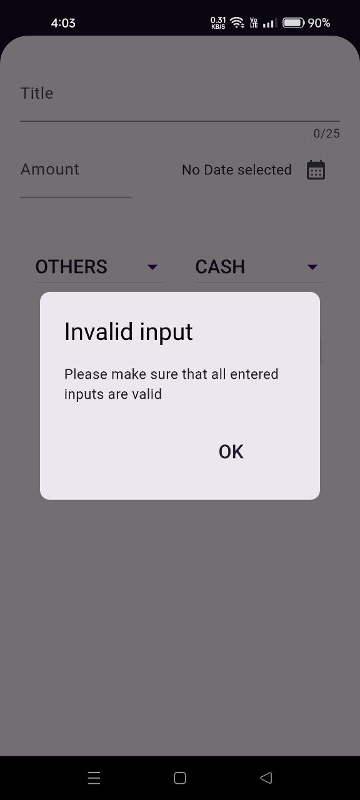
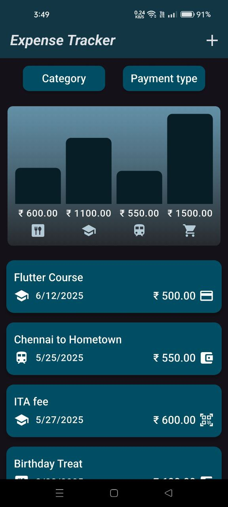
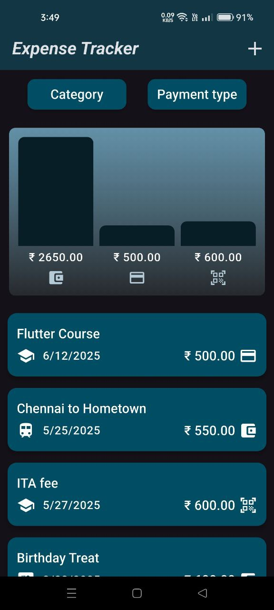
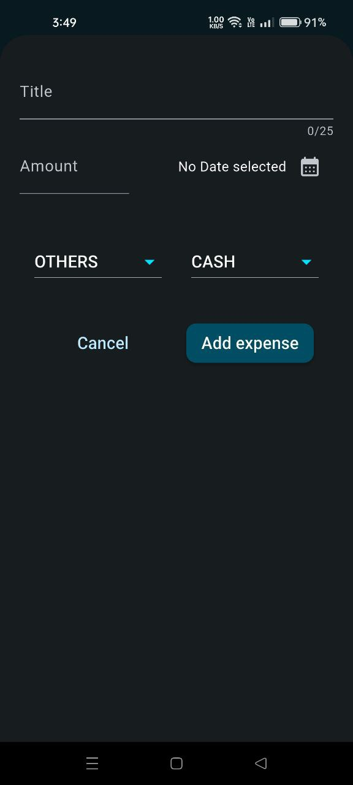
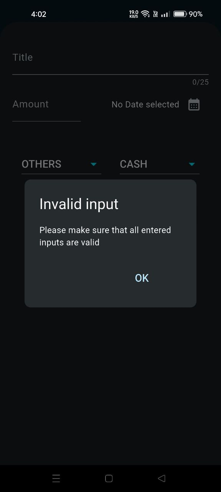

# 💸 Expense Tracker App

A sleek and adaptive **Flutter-based Expense Tracker** that helps you manage your daily expenses with ease.  
Built with responsive UI, support for **light/dark themes**, and full orientation adaptability — this app is perfect for modern budgeting on the go.

---

## 📱 App Preview

  
  
  
  
  
  
  
  

---

## 🌟 Key Features

- 🧾 **Track Expenses**  
  Add, delete, and view your personal expenses with categorized inputs.

- 🌈 **Theme Adaptive**  
  Automatically switches between **light** and **dark** modes based on device theme.

- 📊 **Visual Charts**  
  Summarizes your spending via bar charts grouped by **category** or **payment type**.

- 🧭 **Orientation Support**  
  Works flawlessly in both **portrait** and **landscape** modes.

- 📆 **Date Filtering & Formatting**  
  Organizes expenses by date with localized formatting.

- 🔐 **Undo Deletion**  
  Accidentally removed an expense? Instantly restore with a single tap.

- 📦 **Local JSON Persistence**  
  Expenses are saved locally (e.g., using `shared_preferences` or `json_formatter`) to persist even after app restarts.

---

## 🧰 Built With

| Tool          | Purpose                            |
|---------------|------------------------------------|
| **Flutter**   | Cross-platform mobile development  |
| **Dart**      | Application logic                  |
| **intl**      | Date formatting                    |
| **uuid**      | Unique ID generation for expenses  |
| **Material 3**| Modern UI components               |

---
## 📦 Download

👉 Click the button below to download the latest APK:

  

## 📄 License

This project is licensed under the [MIT License](LICENSE).

You are free to use, modify, and distribute this software with proper attribution.  
See the [LICENSE](LICENSE) file for full license text.

---

## 👨‍💻 Author

**Harish R**  
Flutter Developer | AI & Data Science Enthusiast  
📍 Chennai, India  
🔗 [LinkedIn](www.linkedin.com/in/harish-ai-engineer)  
✉️ harish.ai.engineer@gmail.com

> Passionate about building beautiful, functional, and responsive Flutter apps.

